<div align="center">

<!-- ================================================================= -->
<!-- 🚀 EXECUTIVE HERO BANNER (CO-FOUNDER @ QUANTAFORZE) -->
<!-- ================================================================= -->

<a href="https://abhayanaiengineer.vercel.app/">
  
</a>

<br><br>

<h2>Co-Founder @ Quantaforze &nbsp;•&nbsp; AI Systems &amp; Full-Stack Architect</h2>

<p>Engineering autonomous AI workflows, deep learning pipelines, and resilient full-stack platforms.</p>

<br>

<!-- ================================================================= -->
<!-- 📊 LIVE METRICS & REPUTATION BADGES -->
<!-- ================================================================= -->

<a href="https://github.com/CodeOrbit26">
  
</a>
&nbsp;
<a href="https://github.com/CodeOrbit26">
  
</a>
&nbsp;
<a href="https://github.com/CodeOrbit26">
  
</a>
&nbsp;
<a href="https://github.com/CodeOrbit26?tab=followers">
  
</a>
&nbsp;
<a href="https://www.linkedin.com/in/abhay-gupta-5ba2b737a">
  
</a>
&nbsp;
<a href="https://abhayanaiengineer.vercel.app/">
  
</a>

<br><br>

<!-- Sleek Minimalist Vision Banner -->


<br><br>

<!-- Minimal Laser Hairline Divider -->


</div>

<br>

<!-- ================================================================= -->
<!-- 💻 LIVE TERMINAL HERO (DIAGNOSTICS & RUNTIME) -->
<!-- ================================================================= -->

<div align="center">



<br><br>


</div>

<br>

<!-- ================================================================= -->
<!-- 👤 WHO I AM (CODE DEFINITION) -->
<!-- ================================================================= -->

### `> Who I Am`

```javascript
const abhay = {
  name: "Abhay Gupta",
  handle: "CodeOrbit26",
  role: "Co-Founder @ Quantaforze",
  discipline: "AI/ML Systems & Full-Stack Architect",
  focus: [
    "Agentic AI & Autonomous Workflows",
    "Natural Language Processing (NLP)",
    "Deep Learning & Neural Architectures",
    "Azure AI Cloud Infrastructure"
  ],
  stack: [
    "TypeScript", "Python", "Next.js", 
    "Express.js", "Prisma", "Docker", "Supabase"
  ],
  architecture: "Turborepo Monorepos & High-Availability Microservices",
  flagships: [
    "ConstWare (Enterprise Construction SaaS)",
    "SocialX (Social Engagement Marketplace)",
    "Itz-Me (Engineering Portfolio)"
  ],
  status: "Building autonomous systems and scaling technical ventures",
  portfolio: "https://abhayanaiengineer.vercel.app",
  openToCollaborate: true
};
```

<br>

<div align="center">

</div>

<br>

<!-- ================================================================= -->
<!-- ⚡ REAL-TIME SYSTEM TELEMETRY (SLEEK GAUGES) -->
<!-- ================================================================= -->

<div align="center">

### `> Core Technical Telemetry`

<br>



</div>

<br>

<div align="center">

</div>

<br>

<!-- ================================================================= -->
<!-- 🏗️ FEATURED PROJECTS -->
<!-- ================================================================= -->

### `> Featured Projects`

<br>

<table>
  <tr>
    <td width="50%" valign="top">
      <h3 align="center">🏗️ ConstWare</h3>
      <p align="center">
        <a href="https://constware.vercel.app"></a>
        &nbsp;
        <a href="https://github.com/CodeOrbit26/ConstWare"></a>
      </p>
      <p>
        An enterprise construction management SaaS platform engineered for contractors, site supervisors, and project owners. Built with a unified <strong>Turborepo monorepo</strong> spanning web, API, mobile, and desktop targets.
      </p>
      <p>
        <code>TypeScript</code> · <code>Next.js</code> · <code>Express.js</code> · <code>Prisma</code> · <code>Supabase</code> · <code>Tailwind CSS</code>
      </p>
      <p align="center">
        <a href="https://constware.vercel.app"><strong>🔗 Live Platform</strong></a> &nbsp;•&nbsp; 
        <a href="https://github.com/CodeOrbit26/ConstWare"><strong>📂 Source Code</strong></a>
      </p>
    </td>
    <td width="50%" valign="top">
      <h3 align="center">🔄 SocialX</h3>
      <p align="center">
        <a href="https://socialx-tau-navy.vercel.app"></a>
        &nbsp;
        <a href="https://github.com/CodeOrbit26/SocialX"></a>
      </p>
      <p>
        A social engagement exchange marketplace for creators and brands. Features an automated campaign verification engine, credit-based economy, anti-abuse fraud checks, and administrative dashboard.
      </p>
      <p>
        <code>TypeScript</code> · <code>Next.js</code> · <code>Prisma</code> · <code>NextAuth</code> · <code>Tailwind CSS</code> · <code>Docker</code>
      </p>
      <p align="center">
        <a href="https://socialx-tau-navy.vercel.app"><strong>🔗 Live Platform</strong></a> &nbsp;•&nbsp; 
        <a href="https://github.com/CodeOrbit26/SocialX"><strong>📂 Source Code</strong></a>
      </p>
    </td>
  </tr>
  <tr>
    <td width="50%" valign="top">
      <h3 align="center">🌐 Itz-Me</h3>
      <p align="center">
        <a href="https://abhayanaiengineer.vercel.app"></a>
        &nbsp;
        <a href="https://github.com/CodeOrbit26/Itz-Me"></a>
      </p>
      <p>
        Personal engineering portfolio showcasing technical architecture, project case studies, and engineering philosophy. Built with high performance and mobile-first responsiveness.
      </p>
      <p>
        <code>HTML5</code> · <code>JavaScript</code> · <code>CSS3</code> · <code>Vite</code>
      </p>
      <p align="center">
        <a href="https://abhayanaiengineer.vercel.app"><strong>🔗 Live Site</strong></a> &nbsp;•&nbsp; 
        <a href="https://github.com/CodeOrbit26/Itz-Me"><strong>📂 Source Code</strong></a>
      </p>
    </td>
    <td width="50%" valign="top">
      <h3 align="center">🔭 All Repositories</h3>
      <p align="center">
        <a href="https://github.com/CodeOrbit26?tab=repositories"></a>
      </p>
      <p>
        Explore my complete open-source workspace featuring AI experiments, automation agents, microservices, and web development tooling.
      </p>
      <p>
        <code>Python</code> · <code>TypeScript</code> · <code>Docker</code> · <code>Azure</code>
      </p>
      <p align="center">
        <a href="https://github.com/CodeOrbit26?tab=repositories"><strong>📂 Browse All Repositories →</strong></a>
      </p>
    </td>
  </tr>
</table>

<br>

<div align="center">

</div>

<br>

<!-- ================================================================= -->
<!-- 🛠️ IDENTITY & CAPABILITY INDEX -->
<!-- ================================================================= -->

<div align="center">

### `> System Identity & Benchmark Matrix`

<br>



</div>

<br>

<div align="center">

</div>

<br>

<!-- ================================================================= -->
<!-- 📈 GITHUB METRICS & ANALYTICS -->
<!-- ================================================================= -->

<div align="center">

### `> GitHub Activity & Stats`

<br>

<a href="https://github.com/CodeOrbit26">
  <picture>
    <source media="(prefers-color-scheme: dark)" srcset="https://github-readme-stats.vercel.app/api?username=CodeOrbit26&show_icons=true&theme=transparent&hide_border=true&title_color=38bdf8&icon_color=0ea5e9&text_color=94a3b8&bg_color=00000000&ring_color=38bdf8">
    <source media="(prefers-color-scheme: light)" srcset="https://github-readme-stats.vercel.app/api?username=CodeOrbit26&show_icons=true&theme=default&hide_border=true&title_color=0284c7&icon_color=0ea5e9">
    
  </picture>
</a>
&nbsp;
<a href="https://github.com/CodeOrbit26">
  <picture>
    <source media="(prefers-color-scheme: dark)" srcset="https://github-readme-stats.vercel.app/api/top-langs/?username=CodeOrbit26&layout=compact&theme=transparent&hide_border=true&title_color=38bdf8&text_color=94a3b8&bg_color=00000000&langs_count=6">
    <source media="(prefers-color-scheme: light)" srcset="https://github-readme-stats.vercel.app/api/top-langs/?username=CodeOrbit26&layout=compact&theme=default&hide_border=true&title_color=0284c7&langs_count=6">
    
  </picture>
</a>

<br><br>

<a href="https://github.com/CodeOrbit26">
  <picture>
    <source media="(prefers-color-scheme: dark)" srcset="https://github-readme-streak-stats.herokuapp.com?user=CodeOrbit26&theme=transparent&hide_border=true&ring=38bdf8&fire=38bdf8&currStreakLabel=38bdf8&sideLabels=94a3b8&dates=64748b&currStreakNum=f8fafc&sideNums=f8fafc&background=00000000">
    <source media="(prefers-color-scheme: light)" srcset="https://github-readme-streak-stats.herokuapp.com?user=CodeOrbit26&theme=default&hide_border=true&ring=0ea5e9&fire=0ea5e9&currStreakLabel=0ea5e9">
    
  </picture>
</a>

</div>

<br>

<div align="center">

</div>

<br>

<!-- ================================================================= -->
<!-- 📬 CONNECT & GET IN TOUCH -->
<!-- ================================================================= -->

<div align="center">

### `> Let's Connect`

<p>Always open to discussing AI architecture, autonomous systems, scaling Quantaforze, and technical collaborations.</p>

<br>

<a href="https://www.linkedin.com/in/abhay-gupta-5ba2b737a">
  
</a>
&nbsp;&nbsp;
<a href="https://github.com/CodeOrbit26">
  
</a>
&nbsp;&nbsp;
<a href="https://abhayanaiengineer.vercel.app/">
  
</a>
&nbsp;&nbsp;
<a href="mailto:abhaygupta26nov11@gmail.com">
  
</a>

<br><br><br>

<!-- ================================================================= -->
<!-- ⚡ FOOTER -->
<!-- ================================================================= -->

<sub>
  <strong>ARCHITECT · AUTOMATE · SCALE · SHIP</strong>
  <br><br>
  ⚡ Designed &amp; Engineered with Precision by <a href="https://github.com/CodeOrbit26">Abhay Gupta</a> &bull; Co-Founder @ Quantaforze
</sub>

</div>
